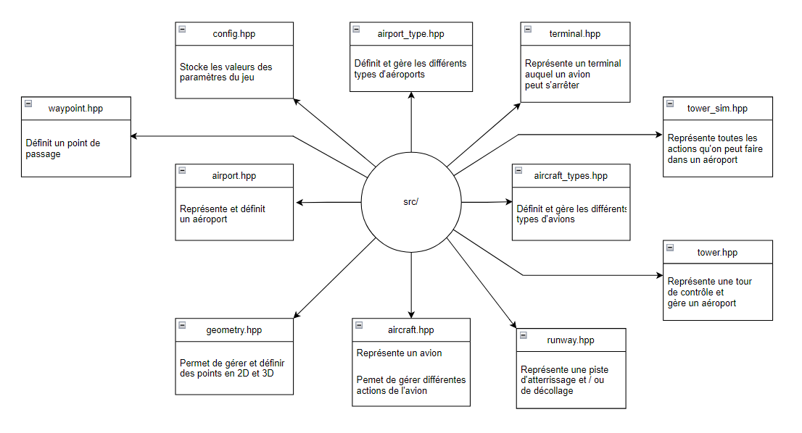
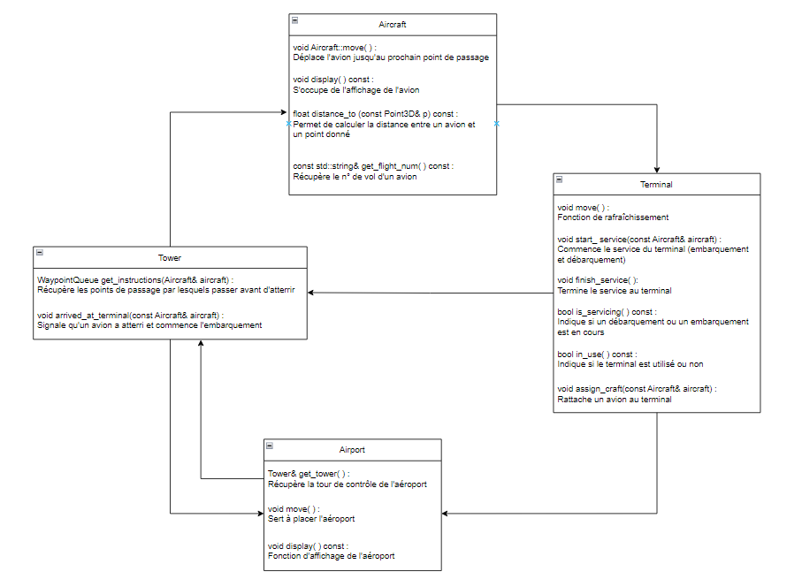

# Se familiariser avec l'existant

## A- Exécution

Compilez et lancez le programme.

Allez dans le fichier `tower_sim.cpp` et recherchez la fonction responsable de gérer les inputs du programme.
Sur quelle touche faut-il appuyer pour ajouter un avion ?
Comment faire pour quitter le programme ?
A quoi sert la touche 'F' ?

___
La fonction responsable de gérer les inputs du programme se nomme `void TowerSimulation::create_keystrokes() const`.

Pour créer un avion, il nous suffit d'appuyer sur la touche 'C'. Pour quitter, c'est les touches 'Q' et 'X'.

La touche 'F' sert à mettre le programme en plein écran.
___
___
Ajoutez un avion à la simulation et attendez.
Que est le comportement de l'avion ?
Quelles informations s'affichent dans la console ?

Ajoutez maintenant quatre avions d'un coup dans la simulation.
Que fait chacun des avions ?
___
L'avion atterrit, reste un peu au sol puis décolle.
Dans la console, on peut y retrouver les actions de l'avion désigné comme son nom et ses actions.

Si on ajoute 4 avions, les 3 premiers atterrissent au sol et y restent un peu et le dernier reste en l'air en attendant que l'un d'eux décolle.
___
___
## B- Analyse du code

Listez les classes du programme à la racine du dossier src/.
Pour chacune d'entre elle, expliquez ce qu'elle représente et son rôle dans le programme.

Pour les classes `Tower`, `Aircraft`, `Airport` et `Terminal`, listez leurs fonctions-membre publiques et expliquez précisément à quoi elles servent.
Réalisez ensuite un schéma présentant comment ces différentes classes intéragissent ensemble.

___
___
Quelles classes et fonctions sont impliquées dans la génération du chemin d'un avion ?
Quel conteneur de la librairie standard a été choisi pour représenter le chemin ?
Expliquez les intérêts de ce choix.
___
Pour générer le chemin d'un avion, on fait juste une suite de `Waypoint`.

Celui-ci est représenté par le conteneur `Deque` de la librairie standard.

Un avion doit passer par chaque point et conserver le même ordre donc ce choix est justifié.
___
## C- Bidouillons !

1) Déterminez à quel endroit du code sont définies les vitesses maximales et accélération de chaque avion.
Le Concorde est censé pouvoir voler plus vite que les autres avions.
Modifiez le programme pour tenir compte de cela.

___
Ces données sont définies dans `aircraft_types.hpp`.

Je change la valeur du `max_air_speed` du Concorde de .05f à .1f afin qu'il soit plus rapide que les autres avions.
___
___
2) Identifiez quelle variable contrôle le framerate de la simulation.\
Le framerate correspond au temps de rafraichissement du programme, c'est-à-dire le nombre de fois où les éléments du programme seront mis à jour (ajout de nouvel avion à la simulation, déplacement, etc) en une seconde.\
Ajoutez deux nouveaux inputs au programme permettant d'augmenter ou de diminuer cette valeur.
Essayez maintenant de mettre en pause le programme en manipulant ce framerate. Que se passe-t-il ?\
Ajoutez une nouvelle fonctionnalité au programme pour mettre le programme en pause, et qui ne passe pas par le framerate.

___
La variable `ticks_per_sec` contrôle le framerate de la simulation dans `opengl_interface.hpp`.

Pour augmenter la valeur, on appuie sur la touche 'U' (celle ci pour up) et pour la diminuer, c'est la touche 'D' (d pour down).
Lorsque le framerate est égal à 0, le programme se ferme tout seul donc j'ai mis une condition afin que le minimum soit 1.

Pour mettre en pause, j'ai rajouté un booléen `pause` qui change d'état si on appuie sur la touche 'P'. 
Si `pause` == true -> on ne déplace pas les avions et inversement.

___
___
3) Identifiez quelle variable contrôle le temps de débarquement des avions et doublez-le.
___
C'est `SERVICE_CYCLES` dans `config.hpp`. On le double donc ça passe de 20u à 40u.
___
___
4) Lorsqu'un avion a décollé, il réattérit peu de temps après.
Assurez-vous qu'à la place, il soit supprimé de la `move_queue`.\
Pour tester, il suffit de dézoomer et de vérifier que les avions suffisament éloignés ne bougent plus.
Indices :\
A quel endroit pouvez-vous savoir que l'avion doit être supprimé ?\
Pourquoi n'est-il pas sûr de procéder au retrait de l'avion dans cette fonction ?
A quel endroit de la callstack pourriez-vous le faire à la place ?\
Que devez-vous modifier pour transmettre l'information de la première à la seconde fonction ?
___
On sait que l'avion part après son service dans la fonction `get_instructions()` de la classe Tower. Cependant, on ne peut pas supprimer l'avion ici car ça posera problème dans la suite du code.

Dès que l'avion a parcouru tous ses `waypoints`, la fonction `move()` retourne true et on indique que son cycle est fini dans la fonction `Tower::get_instructions` -> nous indique qu'on peut le supprimer dans la fonction `timer()` de `opengl_interface.cpp`.

___
___
5) Lorsqu'un objet de type `Displayable` est créé, il faut ajouter celui-ci manuellement dans la liste des objets à afficher.
Il faut également penser à le supprimer de cette liste avant de le détruire.
Faites en sorte que l'ajout et la suppression de `display_queue` soit "automatiquement gérée" lorsqu'un `Displayable` est créé ou détruit.\
Essayez maintenant de supprimer complètement l'avion du programme lorsque vous le retirez de la `move_queue`.\
En dézoomant, vous devriez maintenant constater que les avions disparaissent maintenant de l'écran.
___
6) La tour de contrôle a besoin de stocker pour tout `Aircraft` le `Terminal` qui lui est actuellement attribué, afin de pouvoir le libérer une fois que l'avion décolle.
Cette information est actuellement enregistrée dans un `std::vector<std::pair<const Aircraft*, size_t>>` (size_t représentant l'indice du terminal).
Cela fait que la recherche du terminal associé à un avion est réalisée en temps linéaire, par rapport au nombre total de terminaux.
Cela n'est pas grave tant que ce nombre est petit, mais pour préparer l'avenir, on aimerait bien remplacer le vector par un conteneur qui garantira des opérations efficaces, même s'il y a beaucoup de terminaux.\
Modifiez le code afin d'utiliser un conteneur STL plus adapté. Normalement, à la fin, la fonction `find_craft_and_terminal(const Aicraft&)` ne devrait plus être nécessaire.
___
Modification du code effectué pour les questions précedéntes
## D- Théorie

1) Comment a-t-on fait pour que seule la classe `Tower` puisse réserver un terminal de l'aéroport ?
___
La méthode permettant de gérer ça est privée dans `Airport` et la classe `Tower` est friend de `Airport` 
___
2) En regardant le contenu de la fonction `void Aircraft::turn(Point3D direction)`, pourquoi selon-vous ne sommes-nous pas passer par une réference constante ?
Pourquoi n'est-il pas possible d'éviter la copie du `Point3D` passé en paramètre ?
___
On n'est pas passé par une réference constante car on ne veut pas que la modification du point se propage dans le code et que la méthode `turn` modifie les valeurs du point.
___
## E- Bonus

Le temps qui s'écoule dans la simulation dépend du framerate du programme.
La fonction move() n'utilise pas le vrai temps. Faites en sorte que si.
Par conséquent, lorsque vous augmentez le framerate, la simulation s'exécute plus rapidement, et si vous le diminuez, celle-ci s'exécute plus lentement.

Dans la plupart des jeux ou logiciels que vous utilisez, lorsque le framerate diminue, vous ne le ressentez quasiment pas (en tout cas, tant que celui-ci ne diminue pas trop).
Pour avoir ce type de résultat, les fonctions d'update prennent généralement en paramètre le temps qui s'est écoulé depuis la dernière frame, et l'utilise pour calculer le mouvement des entités.

Recherchez sur Internet comment obtenir le temps courant en C++ et arrangez-vous pour calculer le dt (delta time) qui s'écoule entre deux frames.
Lorsque le programme tourne bien, celui-ci devrait être quasiment égale à 1/framerate.
Cependant, si le programme se met à ramer et que la callback de glutTimerFunc est appelée en retard (oui oui, c'est possible), alors votre dt devrait être supérieur à 1/framerate.

Passez ensuite cette valeur à la fonction `move` des `DynamicObject`, et utilisez-la pour calculer les nouvelles positions de chaque avion.
Vérifiez maintenant en exécutant le programme que, lorsque augmentez le framerate du programme, vous n'augmentez pas la vitesse de la simulation.

Ajoutez ensuite deux nouveaux inputs permettant d'accélérer ou de ralentir la simulation.
